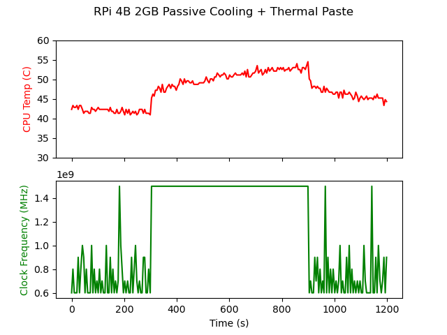
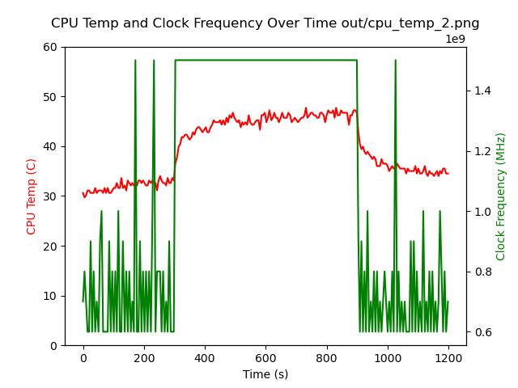

# baking-pis

Benchmarking passively and actively cooled Raspberry Pis with automated analytics.

#### Contents

- [Dependencies](#dependencies)
  - [Raspberry Pi](#raspberry-pi)
  - [Python](#python)
- [Usage](#usage)
- [Results](#results)
  - [Passive Cooling](#passive-cooling)
  - [Active Cooling](#active-cooling)
- [Issues](#issues)

## Dependencies

### Raspberry Pi:

- [`stress-ng`](https://wiki.ubuntu.com/Kernel/Reference/stress-ng)

```bash
# To install on Raspberry Pi OS
sudo apt install stress-ng
```

- Jeff Geerling's [`pi-cpu-stress.sh`](https://gist.github.com/geerlingguy/91d4736afe9321cbfc1062165188dda4) (modified)

```bash
# To download and review the code on your own
wget https://gist.githubusercontent.com/geerlingguy/91d4736afe9321cbfc1062165188dda4/raw/f6cbb1c540405fc677e8f530d878f72d7b7dd226/pi-cpu-stress.sh
```

### Python:

Ensure on your Raspberry Pi that you have Python 3.11.x installed in a virtual environment.

```bash
# Create a virtual environment
python3 -m venv <your-target-dir>

# Activate the virtual environment
source <your-target-dir>/bin/activate

# Tested on Python 3.11.x
pip install -r requirements.txt
```

## Usage

```bash
# Run the benchmarking script
make run
```

## Results

#### Passive Cooling

```
Raspberry Pi 4 Model B 2GB
Armor Passive Heatsink Case
Thermal paste
```



#### Active Cooling

```
Raspberry Pi 4 Model B 4GB
Armor Heatsink Case w/ Fan
Thermal pads
```



## Issues

- [ ] `miniconda` is not available for `armv7l` architecture, so packaged Python in Raspberry Pi OS 32-bit is v3.7.3.
