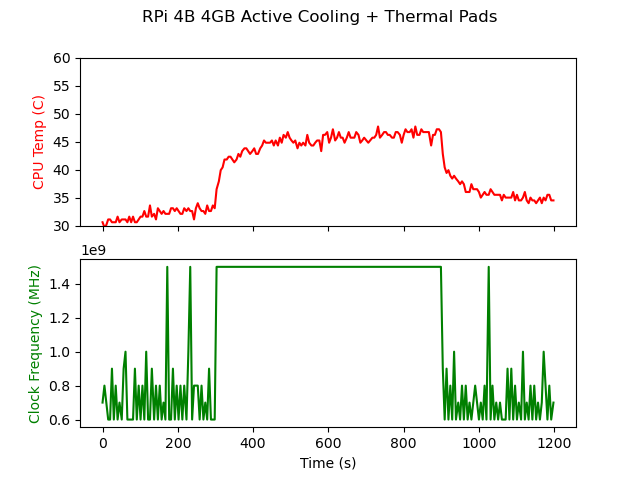

# baking-pis

Benchmarking passively and actively cooled Raspberry Pis with automated analytics.

## Results

#### Passive Cooling

```
Raspberry Pi 4 Model B 2GB
Armor Passive Heatsink Case
Thermal paste
```


#### Active Cooling

```
Raspberry Pi 4 Model B 4GB
Armor Heatsink Case w/ Fan
Thermal pads
```


